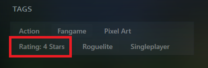
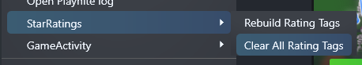

# Star Ratings

Quickly set a **User Score** for your games in Playnite by **right-clicking and
picking a score** from 1-5* (or whatever range you want).

This plugin is built and tested with **Playnite 9**.

## Features

This simple plugin adds some simple options for setting a rating for a game.

- Adds items to the right-click menu for easily setting your rating for a game
- Use a 5-star/3-star/whatever star system you want
- Star ratings are saved in Playnite as the "User Score" value
- Supports 0-star ratings
- Supports clearing an existing User Score value from a game
- Displays a check (☑️) next to an existing rating, if applicable
- Adds main menu items for applying or clearing rating tags from your entire library

> **NOTE - Displaying User Scores as Stars**  
> To show your User Score as stars, you will need to use a theme that supports
> this.
>
> This plugin does not expose any custom controls that can be embedded in a
> theme to support this automatically.

### Mapping Stars to Score

By default, Star Ratings uses a 5-star rating system (can be changed in settings).

Each rating level is spread evenly across the 0-100 score range:

Stars | Score
------|------
1*    | 20
2*    | 40
3*    | 60
4*    | 80
5*    | 100

When you select a rating for a game, it is given the corresponding score.

### Ratings

Tags can be applied based on the rating you've applied to a game. This can add
an additional way for you to filter/sort your library by its game ratings, if
you wish.

> **REMEMBER - Enable Tagging in StarRatings' Settings to Apply Tags**  
> To enable tagging support, go to [Main Menu > Add-ons... > Generic > StarRatings]

Once enabled, a tag will be applied to a game upon rating:

#### Applying/Clearing Tags en Masse

If you want to apply tags to games that you've already rated or remove all
tags altogether, check out the Main Menu items.

> **WARNING - Clear Tags Before Changing Your Rating Scheme**  
> Tags are not currently cleared out when you change your tagging system
> preferences. **To avoid duplicate tags**, clear your tags before you change
> your rating scale or adjust the prefix used for your rating tags.

Under _StarRatings_ are two options:

- **Rebuild Rating Tags**
  - All rated games will be given a tag that corresponds to their rating level.
- **Clear All Rating Tags**
  - Removes all tags used by the current rating system.
  - Warning: As stated above, this is based off of the _current_ rating system.

### Settings

You can configure the number of stars available and add a few utility options:

- **Number of Rating Options**
  - Sets the number of stars you can assign to a game.
  - Default: 5
- **Show Option for 0-Rating**
  - If checked, adds an option to assign 0-stars.
  - Default: No
- **Show Option to Clear Rating**
  - If checked, adds an option to reset the score.
  - Default: No
- **Enable Star Ratings**
  - If checked, allows you to award half a star at each star level. (e.g. 4.5 out of 5 stars)
  - Default: No

- **Should Apply Rating Tag**
  - If checked, will apply a tag to the selected game(s) when rated.
  - This must be enabled to allow for mass (un)tagging.
  - Default: No
- **Rating Tag Prefix**
  - This is used to compose the name of the tag applied.
    - For example, with the default prefix, a 5 star rating would apply the tag: `Rating: 5 Stars`.
  - Default: `Rating: ` (note the trailing space)

To change these settings, visit the "Add-ons" menu and check your "Extension settings".

## To-Do

- [ ] Publish to Playnite Addons
- [ ] Build and deploy on push with GitHub Actions
- [x] Add options for "half stars" like 2.5/5.0 (aka 50 points)
- [ ] Support different rating item styles (e.g., "5*" vs. "5 Stars" vs. "⭐⭐⭐⭐⭐")
- [x] Support generating and clearing tags based on ratings
- [x] Add indicator for current rating in context menu
- [ ] Integrate localization
- [ ] Create a custom user control to encourage custom theme adoption

## Known Issues

- Rating tags are not visible on a game until the next time the game is viewed

## License

MIT License (c) Terry Nguyen 2022

See [THIRDPARTY.md](THIRDPARTY.md) for assets/libraries referenced by this project.
