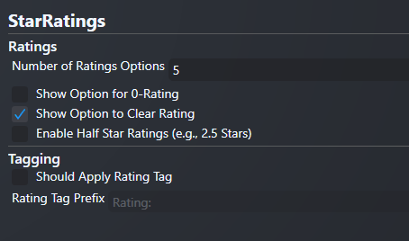

# Star Ratings

Quickly set a **User Score** for your games in Playnite by **right-clicking and
picking a score** from 1-5* (or whatever range you want).

This plugin is built and tested with **Playnite 9**.

## Features

This simple plugin adds some simple options for setting a rating for a game.

- Adds items to the right-click menu for easily setting your rating for a game
- Use a 5-star/3-star/whatever star system you want
- Star ratings are saved in Playnite as the "User Score" value
- Supports 0-star ratings
- Supports clearing an existing User Score value from a game

> **NOTE - Displaying User Scores as Stars**  
> To show your User Score as stars, you will need to use a theme that supports
> this.
>
> This plugin does not expose any custom controls that can be embedded in a
> theme to support this automatically.

### Mapping Stars to Score

By default, Star Ratings uses a 5-star rating system (can be changed in settings).

Each rating level is spread evenly across the 0-100 score range:

Stars | Score
------|------
1*    | 20
2*    | 40
3*    | 60
4*    | 80
5*    | 100

When you select a rating for a game, it is given the corresponding score.

### Settings

You can configure the number of stars available and add a few utility options:

- **Number of Rating Options**
  - Sets the number of stars you can assign to a game.
  - Default: 5
- **Show Option for 0-Rating**
  - If checked, adds an option to assign 0-stars.
  - Default: No
- **Show Option to Clear Rating**
  - If checked, adds an option to reset the score.
  - Default: No
- **Enable Star Ratings**
  - If checked, allows you to award half a star at each star level. (e.g. 4.5 out of 5 stars)
  - Default: No

To change these settings, visit the "Add-ons" menu and check your "Extension settings".

## To-Do

- [ ] Publish to Playnite Addons
- [ ] Build and deploy on push with GitHub Actions
- [x] Add options for "half stars" like 2.5/5.0 (aka 50 points)
- [ ] Support different rating item styles (e.g., "5*" vs. "5 Stars" vs. "⭐⭐⭐⭐⭐")
- [ ] Support generating and migrating tags based on ratings
- [x] Add indicator for current rating in context menu
- [ ] Integrate localization
- [ ] Create a custom user control to encourage custom theme adoption

## License

MIT License (c) Terry Nguyen 2022

See [THIRDPARTY.md](THIRDPARTY.md) for assets/libraries referenced by this project.
